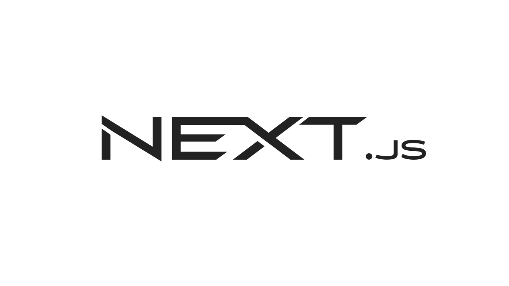
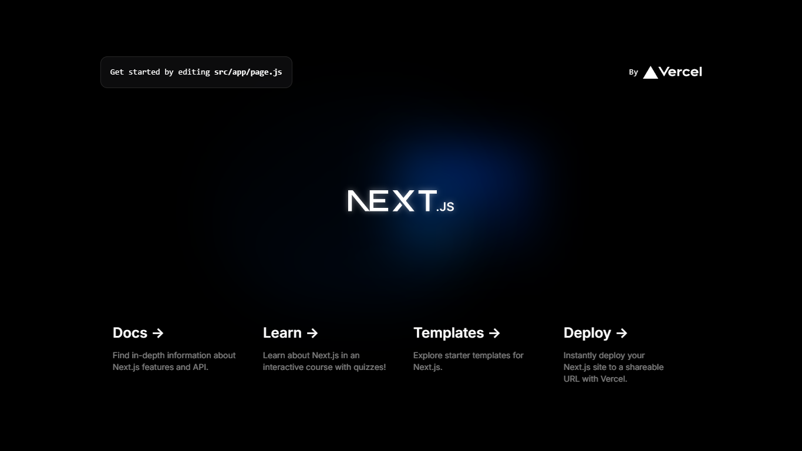
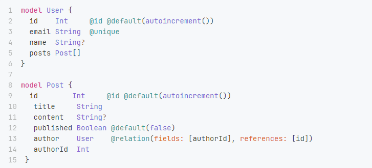

# Tailwind CSS Learnings

<div align="left">
  
  
  
  
  
</div>

###

</div>

###



###

> Next.js é um framework de desenvolvimento para React que facilita a construção de aplicações web e sites. Ele oferece funcionalidades como renderização no lado do servidor (SSR), geração de sites estáticos (SSG), roteamento automático e otimização de desempenho. Essencialmente, Next.js ajuda a criar aplicações React rápidas e escaláveis com menos configuração.

</div>

<ul align="left">
  <li>Framework para ReactJS</li>
  <li>Server-Side Rendering (SSR)</li>
  <li>Pré-configurado (Router, etc)</li>
</ul>

#

### Server-Side Rendering (SSR)

<p>
Significa que a renderização da página ocorre no servidor a cada requisição. Quando um usuário acessa uma página, o Next.js gera o HTML dessa página no servidor e o envia para o cliente. Isso pode melhorar o SEO e o tempo de carregamento inicial, pois o conteúdo está pronto para ser exibido quando chega ao navegador.
</p>

### Search Engine Optimization (SEO)

<p>Conjunto de práticas e técnicas usadas para melhorar a visibilidade e a classificação de um site nos resultados dos motores de busca</p>

### Criando um projeto Next.js (create-next-app)

`npx create-next-app@latest`

### ESLINT

<p><strong>ESLint</strong> é uma ferramenta de linting(analisar o código fonte para identificar e corrigir problemas de estilo, erros e padrões inconsistentes.) para <strong>JavaScript</strong> e TypeScript. Ela analisa seu código para identificar e reportar problemas de estilo e erros, ajudando a manter a qualidade e a consistência do código</p>

### Estrutura básica de pastas para um projecto Next.js

```
my-project/
  .next/
  node_modules/
  pages/
  public/
  package.json
```

### App Router

<p>
Uma nova maneira de organizar e estruturar o projeto. A pasta app é uma nova abordagem para a criação de rotas e layouts em Next.js 13 e posterior, substituindo a estrutura de páginas tradicional.
</p>

### Criar uma Nova Rota

Para cria uma nova rota , pasta adicionar uma nova pasta e utilizar um componente `page.js` dentro dessa nova pasta:

### Navegue até a pasta app e crie uma nova pasta chamada sobre:

`mkdir app/sobre`

### Dentro da nova pasta sobre, crie um arquivo page.js:

```
// app/sobre/page.js
export default function Sobre() {
  return (
    <div className="container mx-auto p-4">
      <h1 className="text-3xl font-bold">Sobre Nós</h1>
      <p className="mt-4">Esta é a página sobre nós.</p>
    </div>
  );
}
```

<strong>Com isso, a nova rota /sobre será criada automaticamente.</strong>



### Dynamic Routes

<p>Permite que criar rotas que podem variar com base nos parâmetros da URL.</p>

### Criar uma Página Dinâmica

<p>Para criar uma rota dinâmica basta criar uma rota inicial ( criando uma pasta )
e dentro dessa nova rota inserir uma rota variável ( como um ID ) entre colchetes :

```
mkdir -p app/produtos/[id]
```

```
// Importando o useParams para capturar parâmetros dinâmicos que são envidado atravéz da URL
import { useParams } from "next/navigation";

export default function Products() {
  // Declarando uma constante que receberá a execução do Hook useParams
  const params = useParams();

  return (
    <main className="flex min-h-screen flex-col items-center justify-between p-24">
      <div className="z-10 max-w-5xl w-full items-center justify-between font-mono text-sm lg:flex">
        <h1 className="text-3xl">PRODUCT</h1>
        <span>ID: {params.id}</span>
      </div>
    </main>
  );
}

```

### Uso do (use client)

```
"use client"

import { useParams } from "next/navigation";

export default function Products() {
  const params = useParams();

  return (
    <main className="flex min-h-screen flex-col items-center justify-between p-24">
      <div className="z-10 max-w-5xl w-full items-center justify-between font-mono text-sm lg:flex">
        <h1 className="text-3xl">PRODUCT</h1>
        <span>ID: {params.id}</span>
      </div>
    </main>
  );
}
```

#

## App DB

### Prisma

<p>
O Prisma permite definir o esquema do banco de dados usando um arquivo de esquema (Prisma Schema) em um formato declarativo. Isso facilita a criação e manutenção de modelos de dados.</p>

<br/>


<br/>
<br/>

<ul>
  <li><strong>Consultas Simplificadas:</strong> Com o Prisma Client, você pode escrever consultas de banco de dados de maneira intuitiva e tipada. Ele gera um cliente que facilita a execução de operações CRUD (Create, Read, Update, Delete) de forma segura e eficiente.</li>
  <li><strong>Migrations:</strong> O Prisma Migrate é uma ferramenta que ajuda a gerenciar as alterações no esquema do banco de dados ao longo do tempo, garantindo que as migrações sejam aplicadas de forma controlada e previsível.</li>
  <li><strong>Integração com TypeScript e JavaScript:</strong> O Prisma oferece suporte robusto para TypeScript e JavaScript, o que pode melhorar a produtividade e reduzir erros, graças ao suporte a tipos estáticos.</li>
  <li><strong>Geração Automática de Código:</strong> O Prisma gera automaticamente código para interações com o banco de dados, o que economiza tempo e reduz a necessidade de escrever código repetitivo.</li>
</ul>

### Instalação ( Em uma aplicação Next.js Com TypeScript )

```
npm install prisma --save-dev
```

```
npx prisma init --datasource-provider sqlite
```

### Criando um Model



<br/>

```
model User {
  id       Int    @id @default(autoincrement())
  email    String @unique
  name     String
  password String
}
```

### Migration

```
npx prisma migrate dev --name init
```

> Migrações são scripts ou arquivos que definem mudanças incrementais no esquema do banco de dados, como adicionar ou remover tabelas, colunas, índices, ou alterar tipos de dados. Elas ajudam a manter o banco de dados atualizado com as mudanças feitas no modelo de dados da aplicação.

<ul>
  <li><strong>Criação de Migrações:</strong> Você define uma nova migração quando faz alterações no modelo de dados. Por exemplo, se você adicionar uma nova tabela ou coluna, você cria uma migração que descreve essas mudanças.</li>
  <li><strong>Aplicação de Migrações:</strong> As migrações são aplicadas ao banco de dados para implementar as alterações definidas. Isso pode ser feito manualmente ou automaticamente, dependendo da ferramenta ou framework.</li>
  <li><strong>Reversão de Migrações:</strong> Caso seja necessário reverter uma mudança, as migrações geralmente suportam a reversão das alterações. Isso permite desfazer a aplicação de uma migração se necessário.</li>
</ul>

> No Prisma, o Prisma Migrate é a ferramenta específica para gerenciar migrações. Ela ajuda a criar, aplicar e reverter migrações de forma eficiente e segura. Outras ferramentas de migração em diferentes contextos incluem:

```
npx prisma migrate dev --name tabela-usuario
```

<p>Agora toda as mudançãs no banco serão registradas e as migrations serao atualizadas ao rodar o comando novamente:</p>

```
model User {
  id       Int    @id @default(autoincrement())
  email    String @unique
  name     String
  password String
  ativo    Boolean @default(true) // alteracao
}
```

```
npx prisma migrate dev --name tabela-usuario-create-col-ativo
```

### Component Next.js (TypeScript)

```js
import Link from "next/link";
import { ElementType } from "react";

// Interface que define um type para as props do componente
export interface MenuItemProps {
  icon: ElementType;
  text: string;
  url: string;
}

export default function MenuItem(props: MenuItemProps) {
  return (
    <Link
      href={props.url}
      className="flex items-center gap-2 px-4 py-2 hover:bg-black"
    >
      <props.icon className="text-zinc-200" />
      <span className="text-zinc-200">{props.text}</span>
    </Link>
  );
}
```

### Criando a listagem de usuários por meio de diferentes componentes

```ts
export interface User {
  id: string;
  email: string;
  name: string;
  password: string;
}
```

Interface para tipar Users

```ts
import { User } from "@/core/model/User";

export interface UserLineProps {
  user: User;
}

export default function UserLine(props: UserLineProps) {
  return (
    <div className="flex p-4 bg-zinc-900 rounded-md">
      <div className="flex flex-col">
        <span>{props.user.name}</span>
        <span className="text-sm text-zinc-400">{props.user.email}</span>
      </div>
    </div>
  );
}
```

Linha que recebe um tipo User como prop

```ts
import users from "../../data/constants/users";
import UserLine from "./UserLine";

export default function UserList() {
  return (
    <div className="flex flex-col gap-4 ">
      {users.map((user) => {
        return <UserLine key={user.id} user={user} />;
      })}
    </div>
  );
}
```

E finalmente a lista que para casa user(usuários do tipo User) cria um componente de userLine

```ts
import { User } from "@/core/model/User";

const users: User[] = [
  {
    id: "1",
    email: "ana@empresa.com.br",
    name: "Ana",
    password: "123456",
  },
  {
    id: "2",
    email: "pedro@empresa.com.br",
    name: "Pedro",
    password: "123456",
  },
  {
    id: "3",
    email: "joao@empresa.com.br",
    name: "Joao",
    password: "123456",
  },
  {
    id: "4",
    email: "gui@empresa.com.br",
    name: "Gui",
    password: "123456",
  },
  {
    id: "5",
    email: "amanda@empresa.com.br",
    name: "Amanda",
    password: "123456",
  },
  {
    id: "6",
    email: "barbara@empresa.com.br",
    name: "Barbara",
    password: "123456",
  },
];

export default users;
```

Lista de usuários do Tipo USER

### Liberando domínio de acesso a imagems (Exemplo Unsplash)

```js
//next.config.msj
/** @type {import('next').NextConfig} */
const nextConfig = {
  images: {
    remotePatterns: [
      {
        protocol: "https",
        hostname: "images.unsplash.com",
        port: "",
        pathname: "/**",
      },
    ],
  },
};

export default nextConfig;
```

### Primeira pequena aplicação FULLSTACK com NEXT.JS

> app-db-aula-yt-cod3r


## Desenvolvendo uma LandingPage com NEXT e Taildwind CSS

### Instalando Fontes e definindo cores personalizadas no NEXT com Tailwind CSS

O Next.js 13 introduziu a integração com Google Fonts usando a API next/font, que facilita o carregamento otimizado das fontes.

```js
import "./globals.css"; // ou o arquivo CSS que você estiver usando
import { Poppins } from "next/font/google";

const poppins = Poppins({
  subsets: ["latin"],
  weight: ["400", "700"], // selecione os pesos que deseja
});

export const metadata = {
  title: "Título do seu projeto",
  description: "Descrição do seu projeto",
};

export default function RootLayout({ children }) {
  return (
    <html lang="en">
      <body className={poppins.className}>{children}</body>
    </html>
  );
}
```

Criar estilos parsonalizados no Tailwind CSS é muito simples:

```js
import type { Config } from "tailwindcss";

const config: Config = {
  content: [
    "./src/pages/**/*.{js,ts,jsx,tsx,mdx}",
    "./src/components/**/*.{js,ts,jsx,tsx,mdx}",
    "./src/app/**/*.{js,ts,jsx,tsx,mdx}",
  ],
  theme: {
    backgroundImage: {
      img_bg_hero: "url('./src/assets/images/bg-hero.png')",
    },
    extend: {
      "primary-purple": "#820BD0",
      "primary-black": "#161616",
      "primary-gray": "#33303E",
      "second-gray": "#4E4B59",
      "gray-phone": "#F4F4F4",
      "text-gray": "#7A7786",
      "opacity-gray": "rgba(100, 80, 57, 0.1)",
    },
  },
  plugins: [],
};
export default config;
```
