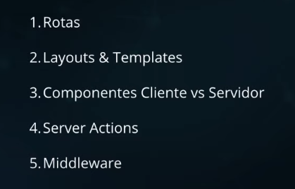
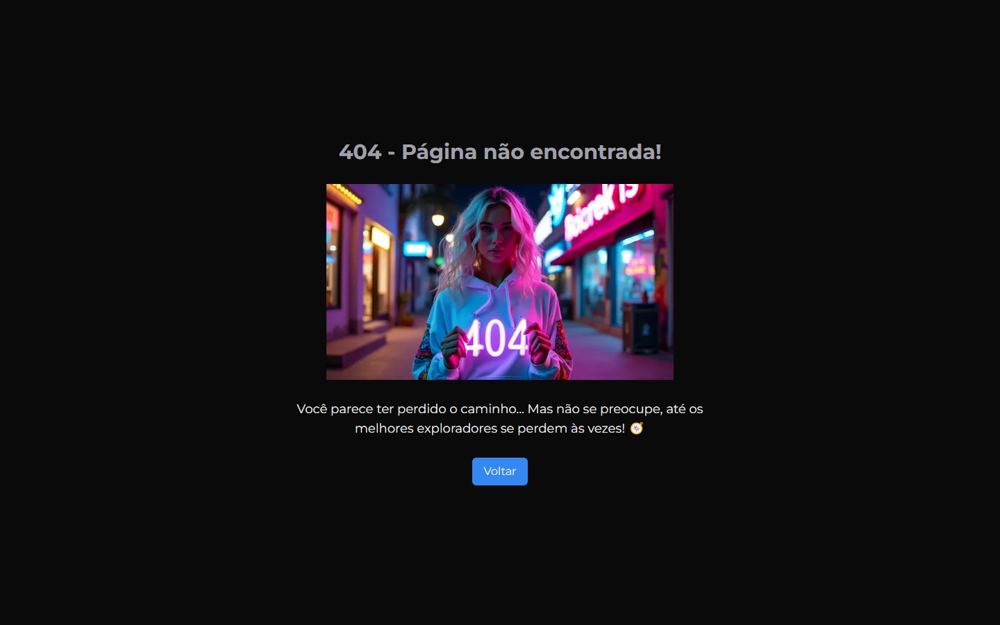
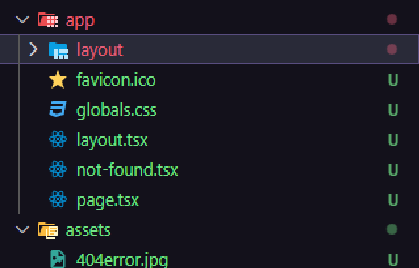
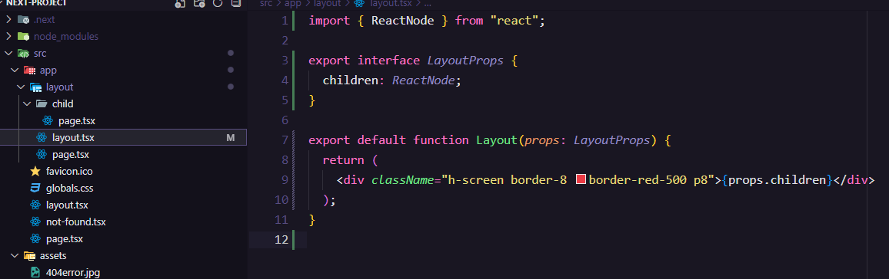
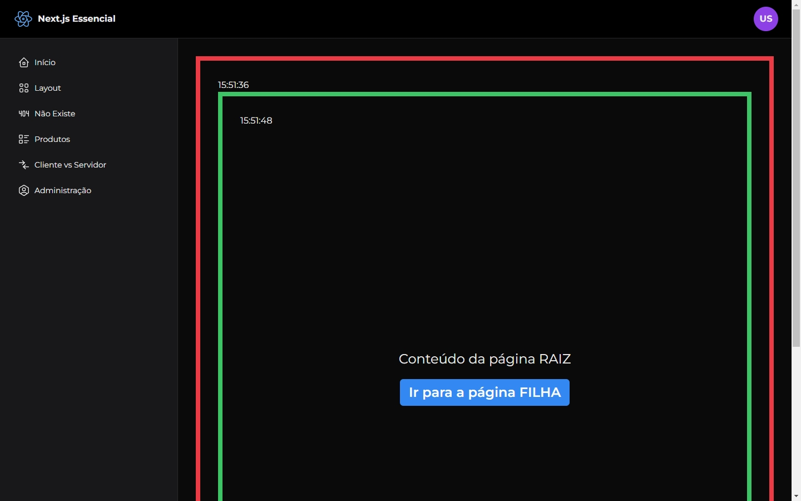
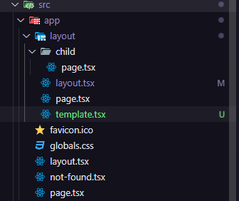
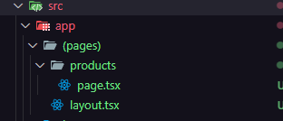
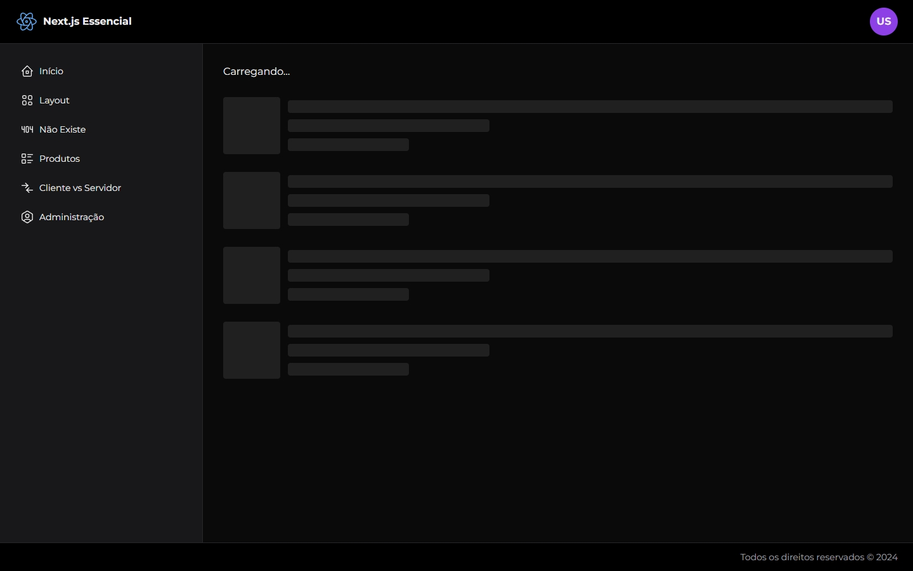

# NEXT.js Learnings

<div align="left">
  
  
  
  
  
</div>

###

</div>

###


###

> Next.js é um framework de desenvolvimento para React que facilita a construção de aplicações web e sites. Ele oferece funcionalidades como renderização no lado do servidor (SSR), geração de sites estáticos (SSG), roteamento automático e otimização de desempenho. Essencialmente, Next.js ajuda a criar aplicações React rápidas e escaláveis com menos configuração.

</div>

<ul align="left">
  <li>Framework para ReactJS</li>
  <li>Server-Side Rendering (SSR)</li>
  <li>Pré-configurado (Router, etc)</li>
</ul>

#

### Server-Side Rendering (SSR)

<p>
Significa que a renderização da página ocorre no servidor a cada requisição. Quando um usuário acessa uma página, o Next.js gera o HTML dessa página no servidor e o envia para o cliente. Isso pode melhorar o SEO e o tempo de carregamento inicial, pois o conteúdo está pronto para ser exibido quando chega ao navegador.
</p>

### Search Engine Optimization (SEO)

<p>Conjunto de práticas e técnicas usadas para melhorar a visibilidade e a classificação de um site nos resultados dos motores de busca</p>

### Criando um projeto Next.js (create-next-app)

`npx create-next-app@latest`

### ESLINT

<p><strong>ESLint</strong> é uma ferramenta de linting(analisar o código fonte para identificar e corrigir problemas de estilo, erros e padrões inconsistentes.) para <strong>JavaScript</strong> e TypeScript. Ela analisa seu código para identificar e reportar problemas de estilo e erros, ajudando a manter a qualidade e a consistência do código</p>

### Estrutura básica de pastas para um projecto Next.js

```
my-project/
  .next/
  node_modules/
  pages/
  public/
  package.json
```

### App Router

<p>
Uma nova maneira de organizar e estruturar o projeto. A pasta app é uma nova abordagem para a criação de rotas e layouts em Next.js 13 e posterior, substituindo a estrutura de páginas tradicional.
</p>

### Criar uma Nova Rota

Para cria uma nova rota , pasta adicionar uma nova pasta e utilizar um componente `page.js` dentro dessa nova pasta:

### Navegue até a pasta app e crie uma nova pasta chamada sobre:

`mkdir app/sobre`

### Dentro da nova pasta sobre, crie um arquivo page.js:

```
// app/sobre/page.js
export default function Sobre() {
  return (
    <div className="container mx-auto p-4">
      <h1 className="text-3xl font-bold">Sobre Nós</h1>
      <p className="mt-4">Esta é a página sobre nós.</p>
    </div>
  );
}
```

<strong>Com isso, a nova rota /sobre será criada automaticamente.</strong>


### Dynamic Routes

<p>Permite que criar rotas que podem variar com base nos parâmetros da URL.</p>

### Criar uma Página Dinâmica

<p>Para criar uma rota dinâmica basta criar uma rota inicial ( criando uma pasta )
e dentro dessa nova rota inserir uma rota variável ( como um ID ) entre colchetes :

```
mkdir -p app/produtos/[id]
```

```
// Importando o useParams para capturar parâmetros dinâmicos que são envidado atravéz da URL
import { useParams } from "next/navigation";

export default function Products() {
  // Declarando uma constante que receberá a execução do Hook useParams
  const params = useParams();

  return (
    <main className="flex min-h-screen flex-col items-center justify-between p-24">
      <div className="z-10 max-w-5xl w-full items-center justify-between font-mono text-sm lg:flex">
        <h1 className="text-3xl">PRODUCT</h1>
        <span>ID: {params.id}</span>
      </div>
    </main>
  );
}

```

### Uso do (use client)

```
"use client"

import { useParams } from "next/navigation";

export default function Products() {
  const params = useParams();

  return (
    <main className="flex min-h-screen flex-col items-center justify-between p-24">
      <div className="z-10 max-w-5xl w-full items-center justify-between font-mono text-sm lg:flex">
        <h1 className="text-3xl">PRODUCT</h1>
        <span>ID: {params.id}</span>
      </div>
    </main>
  );
}
```

#

## App DB

### Prisma

<p>
O Prisma permite definir o esquema do banco de dados usando um arquivo de esquema (Prisma Schema) em um formato declarativo. Isso facilita a criação e manutenção de modelos de dados.</p>

<br/>


<br/>
<br/>

<ul>
  <li><strong>Consultas Simplificadas:</strong> Com o Prisma Client, você pode escrever consultas de banco de dados de maneira intuitiva e tipada. Ele gera um cliente que facilita a execução de operações CRUD (Create, Read, Update, Delete) de forma segura e eficiente.</li>
  <li><strong>Migrations:</strong> O Prisma Migrate é uma ferramenta que ajuda a gerenciar as alterações no esquema do banco de dados ao longo do tempo, garantindo que as migrações sejam aplicadas de forma controlada e previsível.</li>
  <li><strong>Integração com TypeScript e JavaScript:</strong> O Prisma oferece suporte robusto para TypeScript e JavaScript, o que pode melhorar a produtividade e reduzir erros, graças ao suporte a tipos estáticos.</li>
  <li><strong>Geração Automática de Código:</strong> O Prisma gera automaticamente código para interações com o banco de dados, o que economiza tempo e reduz a necessidade de escrever código repetitivo.</li>
</ul>

### Instalação ( Em uma aplicação Next.js Com TypeScript )

```
npm install prisma --save-dev
```

```
npx prisma init --datasource-provider sqlite
```

### Criando um Model


<br/>

```
model User {
  id       Int    @id @default(autoincrement())
  email    String @unique
  name     String
  password String
}
```

### Migration

```
npx prisma migrate dev --name init
```

> Migrações são scripts ou arquivos que definem mudanças incrementais no esquema do banco de dados, como adicionar ou remover tabelas, colunas, índices, ou alterar tipos de dados. Elas ajudam a manter o banco de dados atualizado com as mudanças feitas no modelo de dados da aplicação.

<ul>
  <li><strong>Criação de Migrações:</strong> Você define uma nova migração quando faz alterações no modelo de dados. Por exemplo, se você adicionar uma nova tabela ou coluna, você cria uma migração que descreve essas mudanças.</li>
  <li><strong>Aplicação de Migrações:</strong> As migrações são aplicadas ao banco de dados para implementar as alterações definidas. Isso pode ser feito manualmente ou automaticamente, dependendo da ferramenta ou framework.</li>
  <li><strong>Reversão de Migrações:</strong> Caso seja necessário reverter uma mudança, as migrações geralmente suportam a reversão das alterações. Isso permite desfazer a aplicação de uma migração se necessário.</li>
</ul>

> No Prisma, o Prisma Migrate é a ferramenta específica para gerenciar migrações. Ela ajuda a criar, aplicar e reverter migrações de forma eficiente e segura. Outras ferramentas de migração em diferentes contextos incluem:

```
npx prisma migrate dev --name tabela-usuario
```

<p>Agora toda as mudançãs no banco serão registradas e as migrations serao atualizadas ao rodar o comando novamente:</p>

```
model User {
  id       Int    @id @default(autoincrement())
  email    String @unique
  name     String
  password String
  ativo    Boolean @default(true) // alteracao
}
```

```
npx prisma migrate dev --name tabela-usuario-create-col-ativo
```

### Component Next.js (TypeScript)

```js
import Link from "next/link";
import { ElementType } from "react";

// Interface que define um type para as props do componente
export interface MenuItemProps {
  icon: ElementType;
  text: string;
  url: string;
}

export default function MenuItem(props: MenuItemProps) {
  return (
    <Link
      href={props.url}
      className="flex items-center gap-2 px-4 py-2 hover:bg-black"
    >
      <props.icon className="text-zinc-200" />
      <span className="text-zinc-200">{props.text}</span>
    </Link>
  );
}
```

### Criando a listagem de usuários por meio de diferentes componentes

```ts
export interface User {
  id: string;
  email: string;
  name: string;
  password: string;
}
```

Interface para tipar Users

```ts
import { User } from "@/core/model/User";

export interface UserLineProps {
  user: User;
}

export default function UserLine(props: UserLineProps) {
  return (
    <div className="flex p-4 bg-zinc-900 rounded-md">
      <div className="flex flex-col">
        <span>{props.user.name}</span>
        <span className="text-sm text-zinc-400">{props.user.email}</span>
      </div>
    </div>
  );
}
```

Linha que recebe um tipo User como prop

```ts
import users from "../../data/constants/users";
import UserLine from "./UserLine";

export default function UserList() {
  return (
    <div className="flex flex-col gap-4 ">
      {users.map((user) => {
        return <UserLine key={user.id} user={user} />;
      })}
    </div>
  );
}
```

E finalmente a lista que para casa user(usuários do tipo User) cria um componente de userLine

```ts
import { User } from "@/core/model/User";

const users: User[] = [
  {
    id: "1",
    email: "ana@empresa.com.br",
    name: "Ana",
    password: "123456",
  },
  {
    id: "2",
    email: "pedro@empresa.com.br",
    name: "Pedro",
    password: "123456",
  },
  {
    id: "3",
    email: "joao@empresa.com.br",
    name: "Joao",
    password: "123456",
  },
  {
    id: "4",
    email: "gui@empresa.com.br",
    name: "Gui",
    password: "123456",
  },
  {
    id: "5",
    email: "amanda@empresa.com.br",
    name: "Amanda",
    password: "123456",
  },
  {
    id: "6",
    email: "barbara@empresa.com.br",
    name: "Barbara",
    password: "123456",
  },
];

export default users;
```

Lista de usuários do Tipo USER

### Liberando domínio de acesso a imagems (Exemplo Unsplash)

```js
//next.config.msj
/** @type {import('next').NextConfig} */
const nextConfig = {
  images: {
    remotePatterns: [
      {
        protocol: "https",
        hostname: "images.unsplash.com",
        port: "",
        pathname: "/**",
      },
    ],
  },
};

export default nextConfig;
```

### Primeira pequena aplicação FULLSTACK com NEXT.JS

> app-db-aula-yt-cod3r


## Desenvolvendo uma LandingPage com NEXT e Taildwind CSS

### Instalando Fontes e definindo cores personalizadas no NEXT com Tailwind CSS

O Next.js 13 introduziu a integração com Google Fonts usando a API next/font, que facilita o carregamento otimizado das fontes.

```js
import "./globals.css"; // ou o arquivo CSS que você estiver usando
import { Poppins } from "next/font/google";

const poppins = Poppins({
  subsets: ["latin"],
  weight: ["400", "700"], // selecione os pesos que deseja
});

export const metadata = {
  title: "Título do seu projeto",
  description: "Descrição do seu projeto",
};

export default function RootLayout({ children }) {
  return (
    <html lang="en">
      <body className={poppins.className}>{children}</body>
    </html>
  );
}
```

Criar estilos parsonalizados no Tailwind CSS é muito simples:

```js
import type { Config } from "tailwindcss";

const config: Config = {
  content: [
    "./src/pages/**/*.{js,ts,jsx,tsx,mdx}",
    "./src/components/**/*.{js,ts,jsx,tsx,mdx}",
    "./src/app/**/*.{js,ts,jsx,tsx,mdx}",
  ],
  theme: {
    backgroundImage: {
      img_bg_hero: "url('./src/assets/images/bg-hero.png')",
    },
    extend: {
      colors: {
        "primary-purple": "#820BD0",
        "primary-black": "#161616",
        "primary-gray": "#33303E",
        "second-gray": "#4E4B59",
        "gray-phone": "#F4F4F4",
        "text-gray": "#7A7786",
        "opacity-gray": "rgba(100, 80, 57, 0.1)",
      },
    },
  },
  plugins: [],
};
export default config;
```

## Essencial de NEXT.JS Cod3r



### Alterando porta do localhost (padrão porta 3000)

Usando npm:

```
npm run dev -- -p 4000
```

No arquivo package.json, encontre a seção de scripts e ajuste o comando do dev:

```json
{
  "scripts": {
    "dev": "next dev -p 4000"
  }
}
```

### Bibliotecas de Ícones SVG para o React

<a href="https://github.com/tabler/tabler-icons">https://github.com/tabler/tabler-icons</a>

```
npm install @tabler/icons --save
```

### Bibliotecas de Loading React

<a href="https://www.npmjs.com/package/react-loading-skeleton">https://www.npmjs.com/package/react-loading-skeleton</a>

```
npm install react-loading-skeleton
```

### Criando uma página 404 personalizada

Dentro da pasta APP, crie o arquivo `not-found.tsx ou .jsx`:
Com o App Router, é possível usar arquivos como not-found.tsx dentro da pasta app para lidar com páginas não encontradas (404) de uma forma mais flexível.

```js
import Image from "next/image";
import NotFoundImage from "@/assets/404error.jpg";
import Link from "next/link";

export default function Page404() {
  return (
    <div className="h-screen flex flex-col justify-center items-center gap-7 text-center">
      <h1 className="text-3xl text-zinc-400 font-bold">
        404 - Página não encontrada!
      </h1>
      <Image src={NotFoundImage} alt="Erro 404" width={500} />

      <p className="text-lg max-w-[600px]">
        Você parece ter perdido o caminho... Mas não se preocupe, até os
        melhores exploradores se perdem às vezes! 🧭
      </p>

      <Link href="/" className="bg-blue-500 py-2 px-4 rounded-md">
        Voltar
      </Link>
    </div>
  );
}
```



### Criando Estilos personalizados para classes com no Tailwind CSS

no aquivo `globals.css`:

```css
@layer components {
  .button {
    @apply bg-blue-500 text-gray-50 font-semibold py-2 px-4 rounded-md;
  }
}
```

No componente aplicando a classe criado:

```js
import Link from "next/link";

export default function PageWithLayout() {
  return (
    <div className="flex flex-col justify-center h-screen items-center gap-5 text-2xl">
      <h1>Conteúdo da página RAIZ</h1>
      <Link href="/layout/child" className="button">
        Ir para a página FILHA
      </Link>
    </div>
  );
}
```


### O conceito de Layout

O conceito de Layout no Next.js se refere a uma estrutura reutilizável que permite que componentes e elementos comuns sejam compartilhados entre diferentes páginas ou partes do seu aplicativo. Ele ajuda a manter uma consistência visual e estrutural em todo o projeto, permitindo que partes do design (como cabeçalhos, rodapés, barras de navegação) sejam aplicadas de forma eficiente em várias páginas sem duplicação de código.

Com o `App Router`, a estrutura de layout se torna mais poderosa e simplificada. Cada nível de pastas dentro da estrutura do App Router pode ter seu próprio layout persistente, o que significa que ele pode permanecer o mesmo enquanto o conteúdo da página interna é atualizado. Isso é útil para manter elementos estáticos como menus e rodapés enquanto navega entre páginas.

Com a pasta app/, o arquivo de layout seria chamado `layout.js` ou `layout.tsx` e ficaria na raiz da pasta app.

<strong>Exemplo</strong>

```js
// app/layout.js
export default function RootLayout({ children }) {
  return (
    <html lang="pt-BR">
      <body>
        <header>Barra de Navegação</header>
        {children}
        <footer>Rodapé</footer>
      </body>
    </html>
  );
}
```

Esse LAYOUT JÁ VEM POR PADRÃO NA APLICAÇÃO NEXT



### Criando um Layout Interno

```ts
import { ReactNode } from "react";

export interface LayoutProps {
  children: ReactNode;
}

export default function Layout(props: LayoutProps) {
  return (
    <div className="h-screen border-8 border-red-500 p8">{props.children}</div>
  );
}
```



### useState

Assim que usamos um useState em um arquivo, ele deverar ser to tipo "use client", pois o useState só está disponível no lado do Browser

```ts
"use client";

import { ReactNode, useState } from "react";

import Page from "@/components/template/Page";

export interface LayoutProps {
  children: ReactNode;
}

export default function Layout(props: LayoutProps) {
  const [data] = useState(new Date().toLocaleTimeString());

  return (
    <Page>
      <div className="h-screen border-8 border-red-500 p8">
        {props.children}
      </div>
    </Page>
  );
}
```

### O Conceito de Template

Introduzido com o App Router (a partir da versão 13), se refere a uma estrutura que define uma base comum para páginas dinâmicas ou rotas. Ele permite que o layout e a navegação permaneçam consistentes enquanto o conteúdo da página interna é atualizado dinamicamente. O arquivo template é semelhante ao layout, mas é recriado sempre que a rota muda, permitindo que você reutilize a estrutura visual para várias páginas ou rotas dinâmicas

### Ordem de carregamento

O arquivo `layout.tsx` é carregado antes do arquivo de template, e ambos envolvem o arquivo `page`

```ts
"use client";

import { ReactNode, useState } from "react";

import Page from "@/components/template/Page";

export interface LayoutProps {
  children: ReactNode;
}

export default function Layout(props: LayoutProps) {
  const [data] = useState(new Date());

  return (
    <Page>
      <div className="border-8 border-red-500 p-8">
        <span>{data.toLocaleTimeString()}</span>
        <main>{props.children}</main>
      </div>
    </Page>
  );
}
```

```ts
"use client";

import { ReactNode, useState } from "react";

export interface LayoutProps {
  children: ReactNode;
}

export default function Layout(props: LayoutProps) {
  const [data] = useState(new Date());

  return (
    <div className="border-8 border-green-500 p-8">
      <span>{data.toLocaleTimeString()}</span>
      <main>{props.children}</main>
    </div>
  );
}
```



### Estrutura



> lembrando que a pasta "template" é apenas um nome para a rota

### Criando Router Group



permitir que você organize suas rotas de forma mais eficiente e flexível, sem impactar a estrutura da URL. Com os Router Groups, você pode agrupar componentes e pastas relacionadas, sem que o nome dessas pastas afete a URL final.Router Group envolve o nome da pasta entre parênteses, como (grupo), o que faz com que o Next.js entenda que esse diretório é apenas para organização e não afeta a rota final.

```
/app
  /(admin)            # Grupo que não aparece na URL
    dashboard/page.tsx  # URL: /dashboard
    users/page.tsx      # URL: /users
  /(marketing)        # Outro grupo que não aparece na URL
    blog/page.tsx       # URL: /blog
    pricing/page.tsx    # URL: /pricing
  about/page.tsx      # URL: /about
  contact/page.tsx    # URL: /contact
```

### Criando um loading com o arquivo loading.tsx e Skeleton

O Skeleton Loading é uma prática comum que envolve exibir um layout esquelético enquanto o conteúdo real é carregado, oferecendo uma melhor percepção de desempenho ao usuário.

Primeiro, crie um componente que será exibido enquanto o conteúdo está carregando. Esse componente será uma estrutura esquelética que se parece com o layout final, mas sem dados reais.

```js
// components/Skeleton.js
export default function Skeleton() {
  return (
    <div className="animate-pulse space-y-4">
      {/* Skeleton Header */}
      <div className="h-8 bg-gray-300 rounded"></div>

      {/* Skeleton Body (parágrafos) */}
      <div className="h-6 bg-gray-300 rounded w-3/4"></div>
      <div className="h-6 bg-gray-300 rounded w-full"></div>
      <div className="h-6 bg-gray-300 rounded w-5/6"></div>
    </div>
  );
}
```

#### Crie um arquivo loading.tsx no App Router:

No App Router do Next.js (pasta app/), você pode criar um arquivo loading.tsx em qualquer diretório para mostrar uma tela de carregamento quando os dados ou a página estão sendo carregados.

```js
// app/dashboard/loading.tsx
import Skeleton from "@/components/Skeleton";

export default function Loading() {
  return (
    <div className="p-4">
      <Skeleton />
    </div>
  );
}
```

```ts
import "react-loading-skeleton/dist/skeleton.css";
import Skeleton, { SkeletonTheme } from "react-loading-skeleton";

export default async function Loading(props: { quantidade: number }) {
  function skeleton() {
    return (
      <div className="flex flex-col gap-5">
        <div className="flex items-center gap-3">
          <Skeleton count={1} height={90} width={90} />
          <div className="flex-1 flex flex-col gap-1.5">
            <Skeleton count={1} height={20} containerClassName="flex-1" />
            <Skeleton count={1} height={20} containerClassName="flex-1 w-1/3" />
            <Skeleton count={1} height={20} containerClassName="flex-1 w-1/5" />
          </div>
        </div>
      </div>
    );
  }
  return (
    <div className="flex flex-col gap-6">
      <SkeletonTheme baseColor="#202020" highlightColor="#444">
        <span>Carregando...</span>
        {Array.from({ length: props.quantidade }).map((_, index) => (
          <div key={index}>{skeleton()}</div>
        ))}
      </SkeletonTheme>
    </div>
  );
}
```



SSR (Server-Side Rendering): Normalmente, a página carrega mais rápido para o usuário porque o servidor já envia o HTML completo. Isso significa que o conteúdo está disponível de forma imediata, proporcionando uma experiência de First Contentful Paint (FCP) mais rápida.

CSR (Client-Side Rendering): A carga inicial tende a ser mais lenta porque o navegador precisa baixar e processar o JavaScript antes de mostrar o conteúdo dinâmico. O usuário pode ver uma tela em branco ou um placeholder até que todo o JavaScript seja executado

### Lado servidor e lado do cliente (combinando)

### Componente servidor

```js
export default function Servidor() {
  return (
    <div className="flex gap-3 text-xl bg-blue-600 border-2 border-white p-5">
      <span className="font-bold">Data atual:</span>
      <span>{new Date().toLocaleTimeString()}</span>
    </div>
  );
}
```

### Componente cliente

```js
"use client";
import { useState } from "react";

export default function Cliente() {
  const [data, alterarData] = useState(new Date());

  return (
    <div className="flex flex-col gap-5">
      <div className="flex gap-3 text-xl bg-red-600 border-2 border-white p-5">
        <span className="font-bold">Data atual:</span>
        <span>{data.toLocaleTimeString()}</span>
      </div>
      <button onClick={() => alterarData(new Date())} className="button">
        Atualizar
      </button>
    </div>
  );
}
```

### Combinando os dois componente

```js
import Cliente from "@/components/cliente-servidor/Cliente";
import Servidor from "@/components/cliente-servidor/Servidor";

export default function PaginaClienteServidor() {
  return (
    <div className="flex flex-col gap-10">
      <div>
        <h1>Componente Client</h1>
        <Cliente />
      </div>
      <div>
        <h1>Componente Server</h1>
        <Servidor />
      </div>
    </div>
  );
}
```

Não faria sentido usar toda a página como use client quando apenas uma parte dela é necessário

### Quando usar use client?

<section>
  <h2>Pages Directory (Diretório de páginas)</h2>
  <p>
    Por padrão, as páginas do Next.js que utilizam a função <code>getServerSideProps</code> ou <code>getStaticProps</code> são renderizadas no servidor (SSR) ou pré-renderizadas estaticamente (SSG).
  </p>
  <p>
    Se você não definir uma dessas funções, Next.js utilizará a <strong>Client-Side Rendering (CSR)</strong> para carregar o conteúdo que depende de dados dinâmicos.
  </p>
</section>

<section>
  <h2>App Router (Diretório app/)</h2>
  <p>
    As páginas e componentes neste diretório são <strong>Server-Side Rendered (SSR)</strong> por padrão.
  </p>
  <p>
    Para componentes que precisam ser renderizados no cliente, você deve especificar manualmente o uso do Client-Side usando a diretiva <code>'use client'</code> no topo do arquivo.
  </p>
</section>

<section>
  <h2>Componentes Interativos</h2>
  <p>
    Use <code>'use client'</code> quando o componente contém elementos interativos, como botões, campos de entrada, modais ou qualquer outra funcionalidade que exija manipulação direta do DOM.
  </p>
  <p>
    Exemplos incluem formulários, animações interativas ou qualquer componente que precise responder a eventos de usuário.
  </p>
</section>

<section>
  <h2>Uso de Hooks do React</h2>
  <p>
    Se o seu componente usa hooks como <code>useState</code>, <code>useEffect</code>, <code>useContext</code>, ou qualquer outro hook que dependa do estado do cliente, você precisa usar <code>'use client'</code>.
  </p>
  <p>
    Esses hooks dependem da execução no cliente para manter e atualizar o estado da aplicação.
  </p>
</section>

<section>
  <h2>Dependência de APIs do Navegador</h2>
  <p>
    Quando seu componente precisa acessar APIs que só estão disponíveis no ambiente do navegador, como <code>localStorage</code>, <code>sessionStorage</code>, ou <code>window</code>, você deve marcar o componente com <code>'use client'</code>.
  </p>
  <p>
    Essas APIs não estão disponíveis durante a renderização no servidor.
  </p>
</section>

<section>
  <h2>Componentes de Terceiros que Requerem JavaScript</h2>
  <p>
    Se você estiver usando bibliotecas de terceiros que só funcionam no cliente (como bibliotecas de gráficos interativos ou animações), certifique-se de que seu componente seja um Client Component.
  </p>
</section>

### Quando usar o use server?

<section>
  <h2>Quando usar 'use server'</h2>

  <article>
    <h3>Código Sensível que Não Deve Ser Exposto ao Cliente</h3>
    <p>
      Use <code>'use server'</code> para garantir que a lógica de negócios, cálculos complexos ou dados sensíveis sejam processados apenas no servidor.
    </p>
    <p>
      Isso evita que informações confidenciais, como chaves de API ou dados de usuário, sejam enviados ao cliente.
    </p>
  </article>

  <article>
    <h3>Operações com Banco de Dados e APIs Privadas</h3>
    <p>
      Qualquer operação que interaja diretamente com um banco de dados ou uma API privada deve ser feita no servidor.
    </p>
    <p>
      Por exemplo, funções de manipulação de dados, consultas a bancos de dados e operações CRUD são ótimos candidatos para <code>'use server'</code>.
    </p>
  </article>

  <article>
    <h3>Renderização Inicial para SEO e Performance</h3>
    <p>
      Usar <code>'use server'</code> ajuda a pré-renderizar páginas no servidor, o que é benéfico para SEO e para melhorar a performance inicial do site.
    </p>
    <p>
      Componentes que contêm dados dinâmicos que precisam estar disponíveis imediatamente na renderização inicial devem ser processados no servidor.
    </p>
  </article>

  <article>
    <h3>Melhoria de Desempenho e Tempo de Carregamento</h3>
    <p>
      Lógica pesada de processamento que pode impactar o desempenho do cliente deve ser movida para o servidor.
    </p>
    <p>
      Isso reduz a carga no lado do cliente e melhora a experiência do usuário ao carregar as páginas mais rapidamente.
    </p>
  </article>
</section>

<section>
  <h2>Exemplo de Uso</h2>
  <pre>
<code>
'use server';

import { fetchDataFromDatabase } from './database';

export default async function ServerComponent() {
const data = await fetchDataFromDatabase();

return (
<div>
<h1>Dados Sensíveis</h1>
<p>{data}</p>
</div>
);
}
</code>

  </pre>
</section>

<section>
  <h2>Resumo</h2>
  <ul>
    <li>Use <code>'use server'</code> para lidar com dados sensíveis que não devem ser expostos ao cliente.</li>
    <li>Utilize para operações com bancos de dados ou APIs privadas.</li>
    <li>Melhore SEO e performance com renderização no servidor.</li>
    <li>Execute lógica de negócios complexa para reduzir a carga no cliente.</li>
  </ul>
  <p>
    Por padrão, no App Router (<code>app/</code>), tudo é renderizado no servidor, mas você pode usar <code>'use server'</code> para tornar explícito que o código deve ser tratado exclusivamente no servidor.
  </p>
</section>


### Middlewares 

Em Next.js, os middlewares desempenham um papel importante na manipulação de solicitações HTTP. Eles podem ser configurados para executar código durante a fase de processamento da requisição, antes que a resposta seja enviada de volta para o cliente. Essa abordagem é útil para aplicar lógica comum em várias rotas, como validações ou redirecionamentos.

No Next.js, os middlewares são definidos em um arquivo específico chamado `middleware.js` ou middleware.ts na `raiz do seu projeto`. Eles funcionam interceptando requisições para todas as rotas ou para um subconjunto de rotas que você especificar
